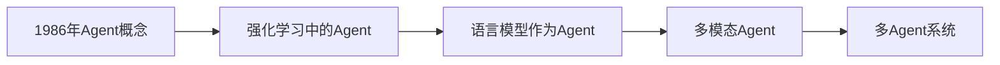
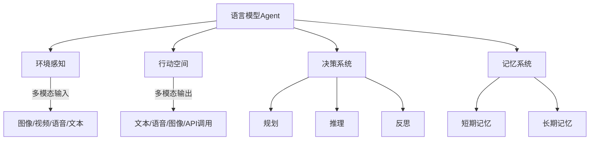
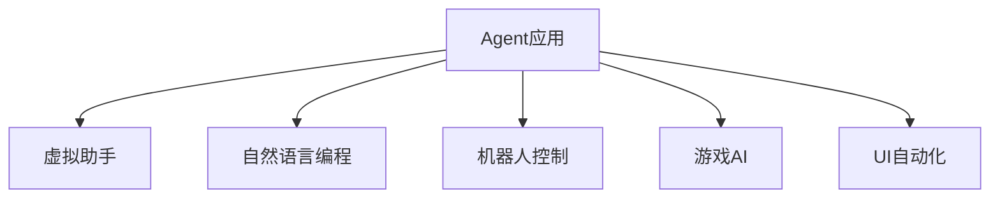
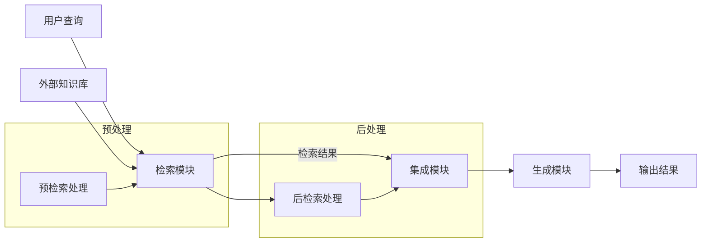
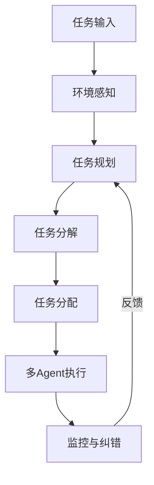

## 1. Agent的概念演变

Agent的概念从1986年提出以来,经历了多个阶段的发展和应用:

## 2. 语言模型作为Agent的构成

现代的语言模型Agent由以下几个主要部分组成:

### 2.1 环境感知
- 多模态输入: 能够处理图像、视频、语音和文本等多种形式的输入。

### 2.2 行动空间
- 多模态输出: 可以生成文本、语音、图像,或调用外部API。

### 2.3 决策系统
- 规划: 能够制定达成目标的计划。
- 推理: 基于已知信息进行逻辑推理。
- 反思: 对自身行为进行评估和改进。

### 2.4 记忆系统
- 短期记忆: 存储当前对话或任务相关的临时信息。
- 长期记忆: 保存长期有用的知识和经验。

## 3. Agent的应用领域

Agent技术在多个领域都有广泛应用:

- 虚拟助手: 如Siri, Alexa等智能个人助理。
- 自然语言编程: 通过自然语言描述来生成代码。
- 机器人控制: 用于控制各种类型的机器人。
- 游戏AI: 在游戏中创造智能非玩家角色(NPC)。
- UI自动化: 自动化用户界面测试和操作。

## 4. 检索增强型大语言模型(RA-LLM)

RA-LLM是为了解决传统大语言模型在特定领域知识不足和产生幻觉等问题而提出的新型模型:

### 4.1 RA-LLM的主要组成部分
- 检索模块: 从外部知识库中检索相关信息。
- 集成模块: 将检索到的信息与用户查询整合。
- 生成模块: 基于整合后的信息生成回答。

### 4.2 RA-LLM的优势
- 可以获取最新和专业的领域知识。
- 减少幻觉问题,提高回答的准确性。
- 易于更新知识,无需重新训练整个模型。

## 5. 多Agent系统中的决策过程

在多Agent系统中,决策过程涉及多个步骤:

- 环境感知: 收集和处理环境信息。
- 任务规划: 制定整体任务计划。
- 任务分解: 将复杂任务分解为子任务。
- 任务分配: 将子任务分配给不同的Agent。
- 多Agent执行: 各Agent并行执行分配的任务。
- 监控与纠错: 实时监控执行情况,必要时进行调整。

## 总结

Agent技术,特别是基于大语言模型的Agent,正在快速发展并在多个领域展现出巨大潜力。随着检索增强型大语言模型(RA-LLM)等新技术的出现,AI系统在处理复杂任务和特定领域应用方面的能力正在不断提升。多Agent系统的发展更进一步扩展了AI的应用范围和复杂度。这些进展预示着AI技术在未来将在更广泛的领域发挥重要作用。