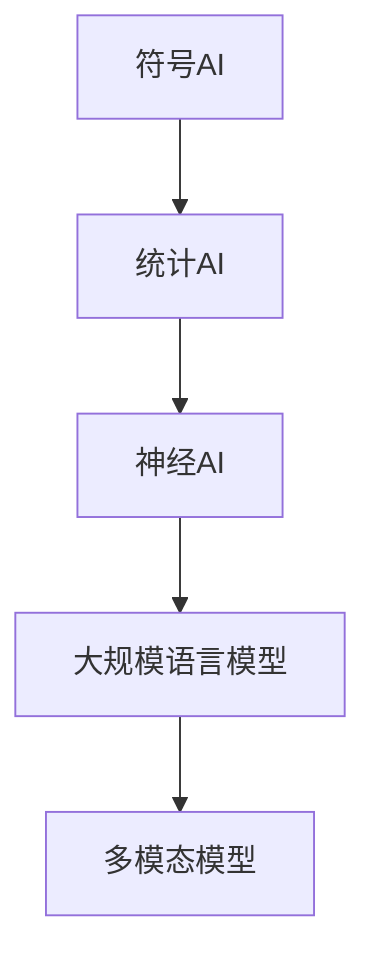
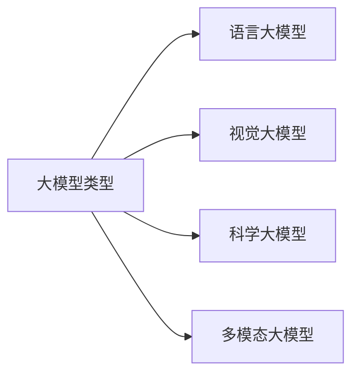
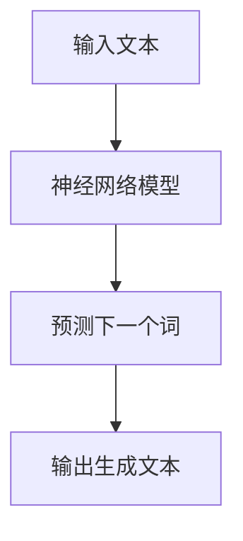
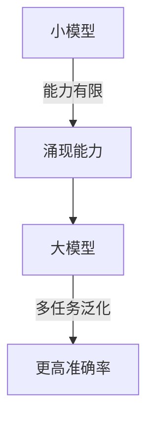
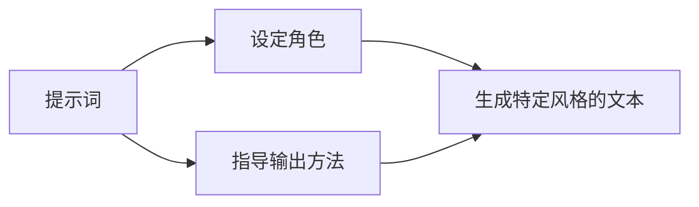
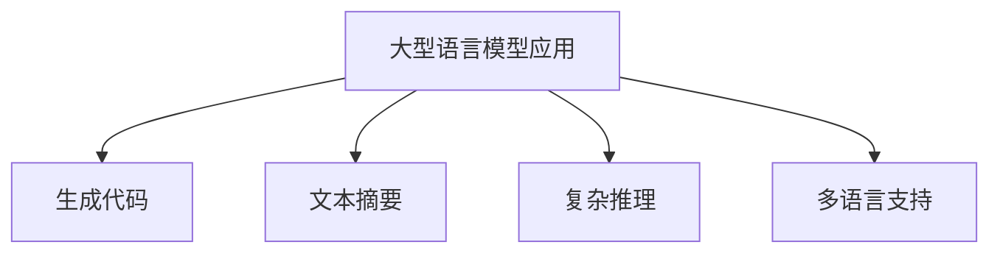

### 1. 大模型的发展历程

大模型的发展经历了多个阶段，从早期的符号AI，到1980年代后的统计AI与神经AI，再到如今的大规模语言模型（LLMs）和多模态模型。

### 2. 大模型的类型

当前的大模型主要包括以下几种类型：

- 语言大模型（如GPT系列）
- 视觉大模型（如Stable Diffusion）
- 科学大模型（如AlphaFold）
- 多模态大模型（如PaLM-E）

### 3. 语言建模问题

语言模型旨在回答"文本的概率是什么？"的问题。通过神经网络（如GPT-3、GPT-4）进行语言建模，能够生成与上下文相关的连贯文本。

### 4. 大型语言模型的特性

- **涌现能力**：一些能力在小模型中不存在，但在大模型中出现。
- **多任务泛化能力**：单个模型能够解决多个自然语言处理任务。
- **作为知识库**：语言模型可以作为知识库提供信息（尽管不总是准确）。

### 5. 提示词工程（Prompt Engineering）

提示词工程是一种与大型语言模型（LLMs）进行交互的方式，通过调整输入内容（提示词），来最大化模型的输出效果。提示词可以设定模型的角色或指导其输出处理方法。

### 6. 应用场景

大型语言模型被广泛应用于各类任务中，如生成代码、文本摘要、复杂推理、多语言支持等。

