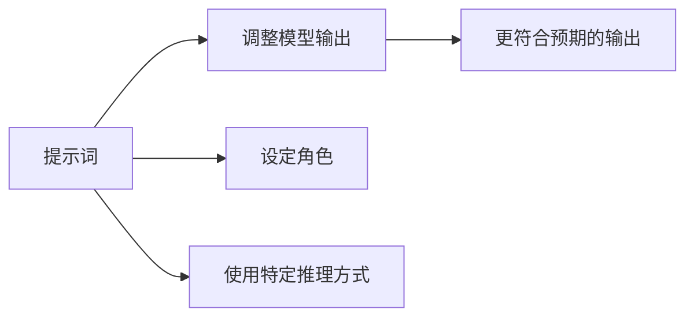
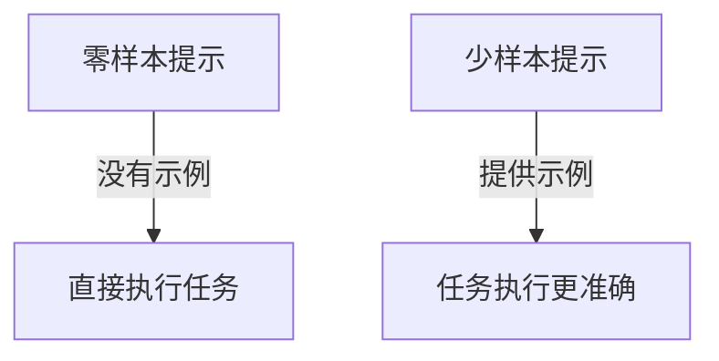
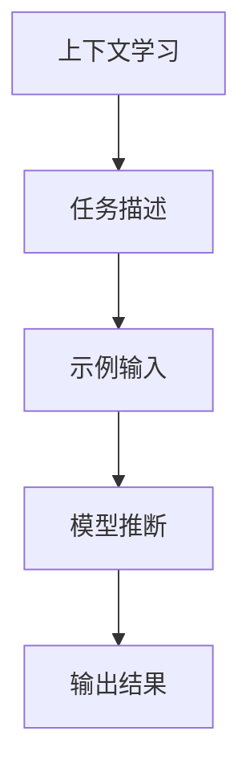
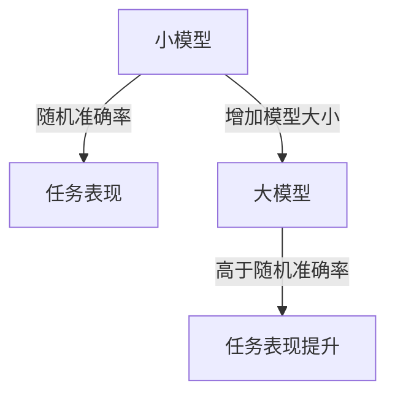
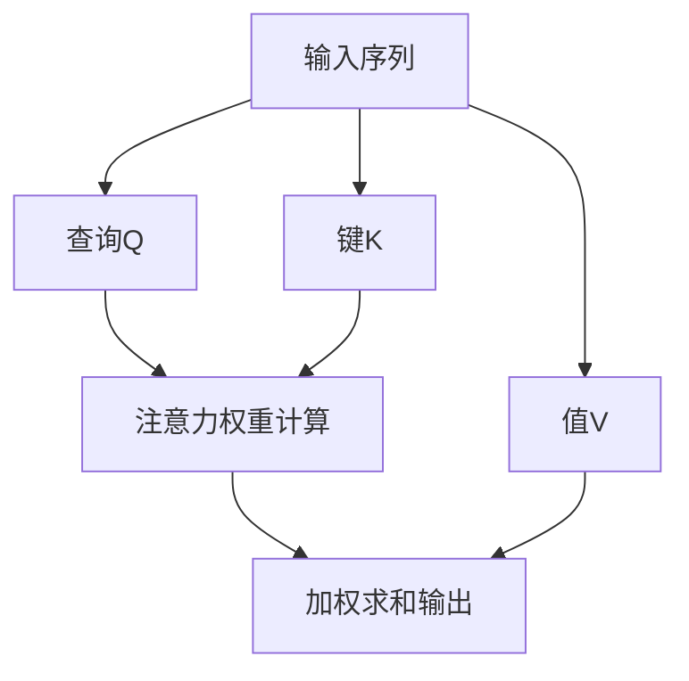
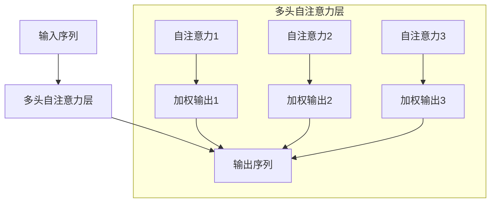
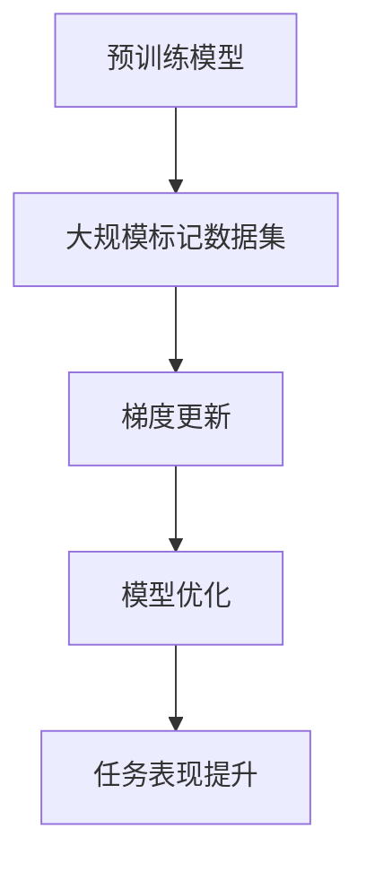

### 1. 提示词工程（Prompt Engineering）

提示词工程是指通过定制输入内容，使得大型语言模型（LLM）输出更加符合预期。提示词可以是让模型扮演某种角色（如老师或海盗），或使用特定的推理方法（如“思维链”）来处理输出。

### 2. 零样本与少样本提示（Zero-shot and Few-shot Prompting）

- **零样本提示（Zero-shot Prompting）**：直接给出任务指令，不提供任何示例。
- **少样本提示（Few-shot Prompting）**：在提示中提供几个示例，以引导模型给出更好的答案。

### 3. 上下文学习（In-Context Learning, ICL）

- 上下文学习指的是在推理阶段不对模型参数进行训练或优化，只提供任务描述及一些示例（零样本、单样本或少样本）。
- 该方法无需梯度更新，直接根据提供的上下文进行学习。

### 4. Emergent Abilities in Large Language Models

随着模型规模的增大，某些能力会在小模型中不存在，但在大模型中出现，这被称为“涌现能力”。例如，在大模型中，使用少样本提示可以大大提高某些任务的准确率。

> 由人们在大模型的研究中发现的现象，并非先存在了能够使得大模型具备涌现能力的方法

### 5. 自注意力机制（Self-Attention Mechanism）

Transformer模型的核心机制是自注意力（Self-Attention），它允许模型在对序列中的每个词进行计算时同时考虑序列中的所有其他词。这种机制使得模型能够捕捉到更复杂的依赖关系。

### 6. 多头自注意力机制（Multi-Head Self-Attention）

多头自注意力机制通过并行的多个自注意力层，帮助模型学习到不同的特征表示，进而增强模型的表达能力。

### 7. 梯度下降与模型优化

传统的模型优化方法是通过在大规模标记数据集上进行反复的梯度更新来微调模型参数。每个任务都需要一个新的大型数据集，并且可能导致泛化能力差的问题。

