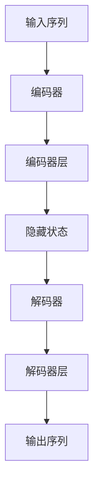
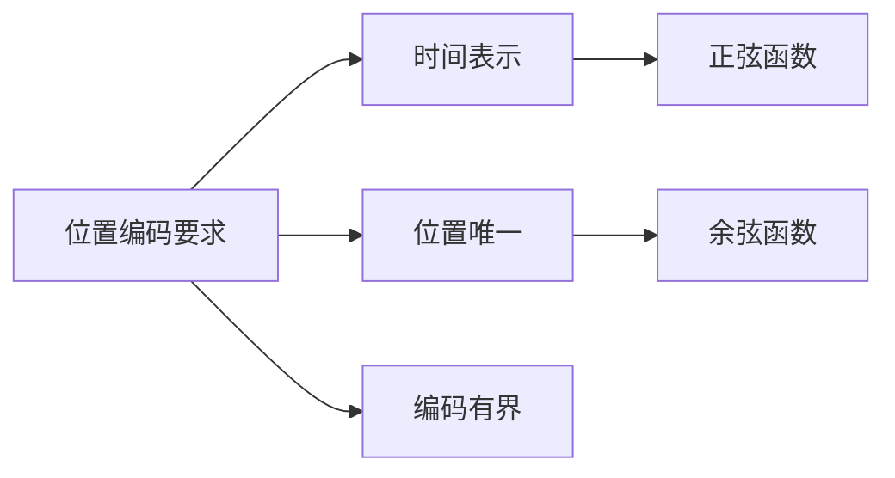
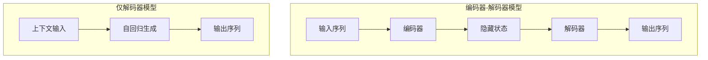
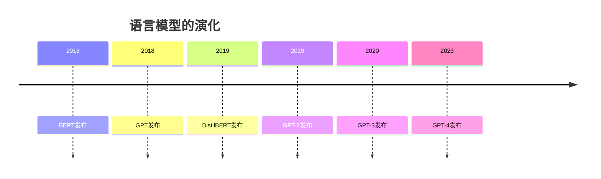
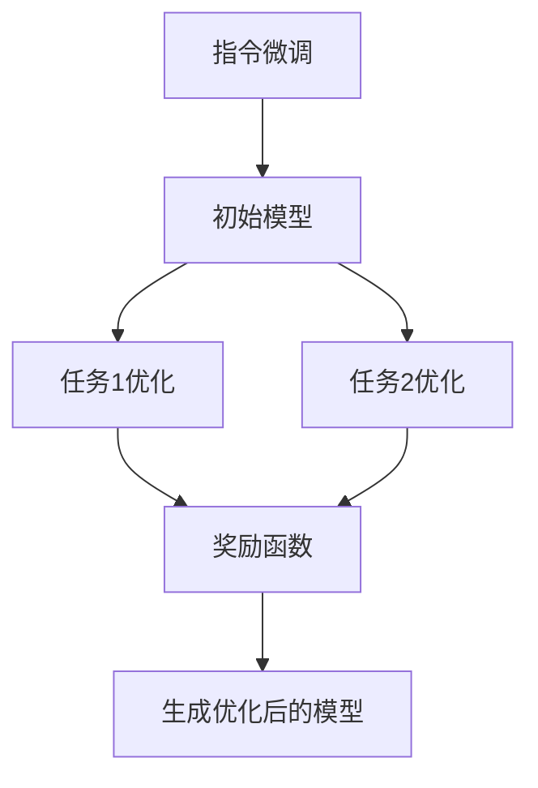

### 1. Transformer架构

Transformer是目前最流行的深度学习模型之一，特别是在自然语言处理（NLP）领域。它主要由两个部分组成：编码器（Encoder）和解码器（Decoder）。

- **编码器（Encoder）**：用于处理输入序列，并生成一系列隐藏状态。
- **解码器（Decoder）**：用于生成输出序列，通过注意力机制关注编码器的输出。

以下是Transformer架构的Mermaid图：

### 2. 位置编码（Positional Encoding）

Transformer的一个重要特性是它没有内置的顺序感知能力，因此使用了**位置编码（Positional Encoding）** 来表示输入序列中各个元素的位置。位置编码通常通过正弦和余弦函数生成，确保每个位置的编码都是唯一的。

### 3. 编码器-解码器模型与仅解码器模型

- **编码器-解码器模型**：常用于翻译任务，编码器将输入序列转换为隐藏状态，解码器根据隐藏状态生成输出。
- **仅解码器模型**：通常用于生成任务（如文本生成），它基于先前生成的上下文来生成下一步。

### 4. 语言模型的演化

语言模型的演化展示了从BERT到GPT的进化历程，其中BERT是一种双向编码模型，适合理解任务；而GPT是一种生成模型，擅长生成自然流畅的文本。以下是主要模型的时间线：

### 5. 指令微调（Instruction Fine-Tuning）与基于人类反馈的强化学习（RLHF）

- **指令微调（Instruction Fine-Tuning）**：通过在许多任务上收集（指令，输出）对来微调语言模型，使其在未见过的任务上表现更好。
- **基于人类反馈的强化学习（RLHF）**：结合强化学习和人类反馈的方法来优化模型，使其输出更符合人类偏好。

以下是RLHF的基本流程图：

**通过预训练和微调策略，LLM（大型语言模型）能够在零样本和少样本学习的情况下执行任务**